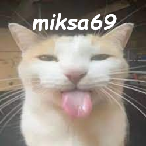

<a id="readme-top"></a>

<!-- PROJECT LOGO -->
<br />
<div align="center">
  <a href="https://github.com/miksa699/Random-kysymyspeli-python">
    
  </a>

<h3 align="center">Simple Python Game</h3>

  <p align="center">
    Random game made in python... Edit to your likings
    <br />
    <a href="https://github.com/miksa699"><strong>miksa699</strong></a>
    <br />
    <br />
    <a href="https://github.com/miksa699/repo_name">View Demo</a>
    ·
    <a href="https://github.com/miksa699/Random-kysymys-python/issues/new?labels=bug&template=bug-report---.md">Report Bug</a>
    ·
    <a href="https://github.com/miksa699/Random-kysymys-python/issues/new?labels=enhancement&template=feature-request---.md">Request Feature</a>
  </p>
</div>

# Random-kysymyspeli-python
Joku random simppeli python peli. 

Random game made in python... Edit to your likings

# Requirements

### Python 3.11.x
Get it [here](https://www.python.org/downloads/) or Microsoft Store

## PIP
   After python is installed, run this command in cmd to see if you have pip
   ```sh
   python -m pip
   ```
### PIL
   Install pillow for the images
   ```sh
   pip install pillow
   ```
### pygame
   This script uses mp3 files so i used pygame.
   ```sh
   pip install -U pygame==2.6.0
   ```

<p align="right">(<a href="#readme-top">back to top</a>)</p>
